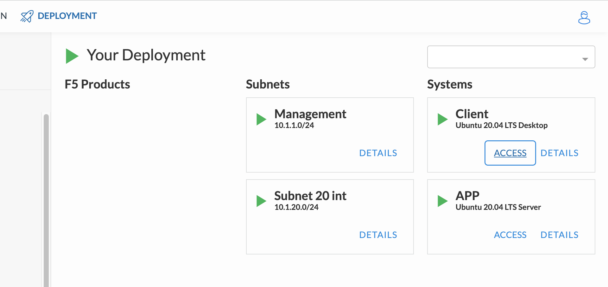

About The Lab
====

Topology
----

.. image:: img/topologi.jpeg

*Client* node
  This node will be used as jump host and test client. It uses RDP protocol to access.

*App* node 
  This is where we will deploy *Arcadia Apps* and *NGINX Plus Ingress Controller*.
  The **Arcadia Apps** is micro-services based hence *k3s* cluster need to be installed in this node.

KIC
  Kubernetes Ingress Controller using *NGINX Plus Ingress Controller* with *App. Protect* enabled

Main
  The pod of main Arcadia app

Backend
  The pod of Arcadia app for ``/files`` endpoint

App2
  The pod of Arcadia app money transfer service

App3
  The pod of Arcadia app referral service

Your Lab. Deployment
----

Check you lab. deployment status, it should be all green and ready.
You can use *ACCESS* button in *Client* and *APP* node to see available access options.

Reset *ubuntu* User Password
----

.. warning::
  You need to execute this step.
  Because default *ubuntu* user password is unknown hence we need to reset it.

Now we will change the password for *ubuntu* user.
In your deployment, from *APP* node select *ACCESS > Web Shell*

.. image:: img/webshell.png

Now you should got root prompt from the *Web Shell*. Use below command to change *ubuntu* user password::
  
  # passwd ubuntu

When prompted, type *ubuntu* in the *New password* & *Retype new password* prompt

.. image:: img/ch-ubuntu-passwd.png

Access The *Client* Node Using xRDP
----

Every step in this lab. will be done from *Client* node over remote desktop.
This method protects from losing session when network disconnect happen.
You will need a RDP client installed in your laptop / PC.

In your deployment, from *Client* node select **ACCESS > xRDP > 1280x800**. Then a RDP file will be downloaded.

.. image:: img/xrdp.png

Click on downloaded RDP file to open it in RDP client.
When prompted, enter credential *ubuntu/ubuntu* to login.

Access The *APP* Node From *Client* Node
----

After login to *Client* node, open *Terminal Emulator* from dock menu.

then remove ``known_hosts`` file::

    $ rm /home/ubuntu/.ssh/known_hosts

Now access to *APP* node and use "*ubuntu*" as password when prompted::

    $ ssh app

Now you should be able to login to *APP* node as *ubuntu* user from *Client* node.