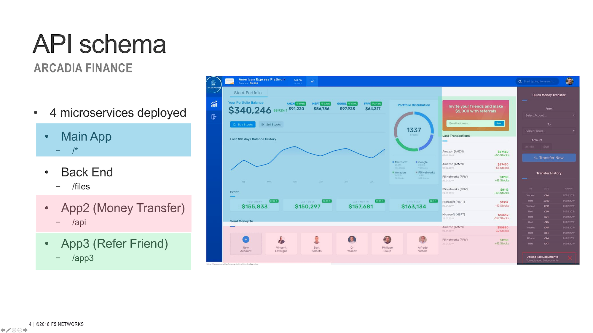
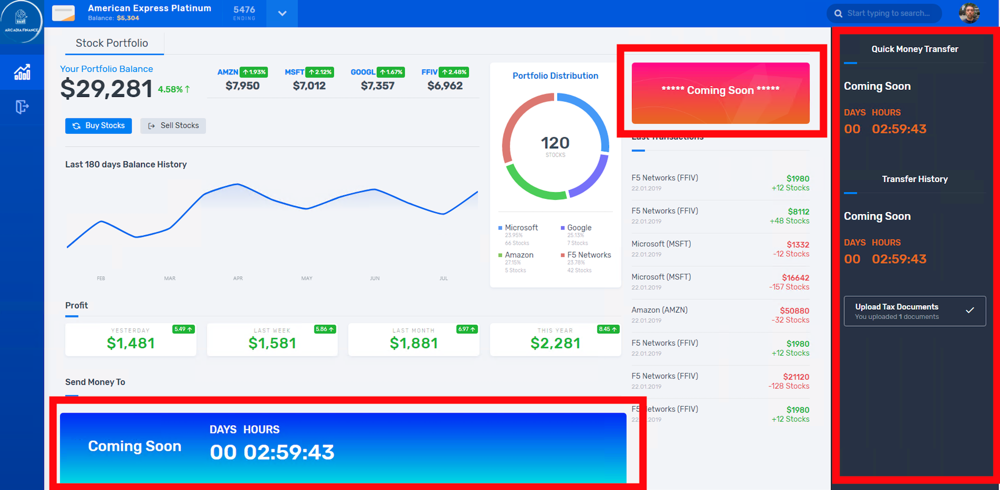
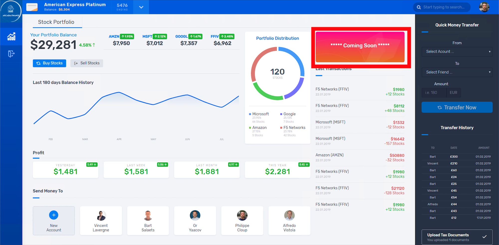
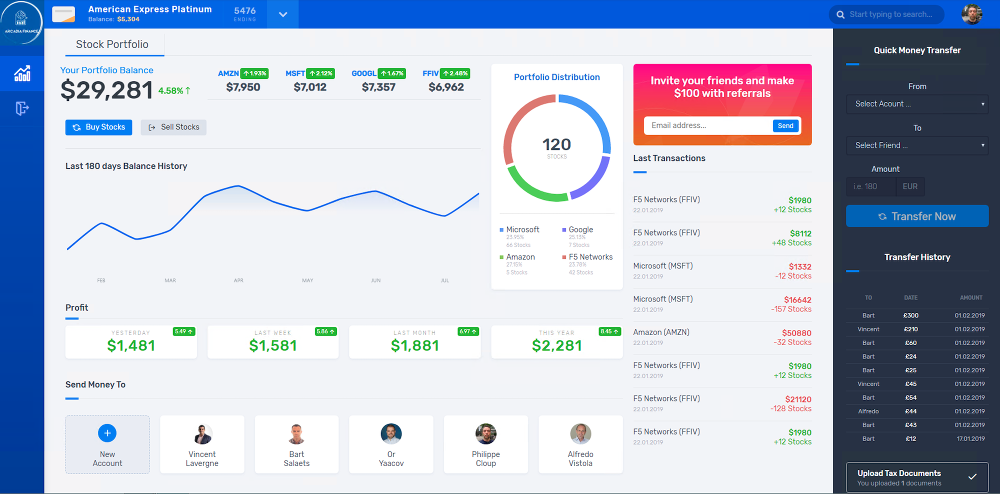

Deploy The Arcadia App
====

Architecture
----

.. note:: 
  This application is available in GitLab <https://gitlab.com/arcadia-application>_

This is the architecture of Arcadia apps. It has 4 micro-services. It routed using URI.

This is what it's look like when only main and backend app deployed.

This is main, backend and money transfer deployed.

This is main, backend, money transfer and referral deployed.

Deploy in kubernetes
---

.. note::
  For the interrest of time, the apps is already deployed.

Login to *APP* node if you're not there::

  $ ssh app

Enter arcadia directory::

  $ cd /home/ubuntu/arcadia

Examine app deployment file ``app.yaml`` below::

  ##################################################################################################
  # FILES - BACKEND
  ##################################################################################################
  apiVersion: v1
  kind: Service
  metadata:
    name: backend
    labels:
      app: backend
      service: backend
  spec:
    type: NodePort
    ports:
    - port: 80
      nodePort: 31584
      name: backend-80
    selector:
      app: backend
  ---
  apiVersion: apps/v1
  kind: Deployment
  metadata:
    name: backend
    namespace: default
    labels:
      app: backend
      version: v1
  spec:
    replicas: 1
    selector:
      matchLabels:
        app: backend
        version: v1
    template:
      metadata:
        labels:
          app: backend
          version: v1
      spec:
        containers:
        - env:
          - name: service_name
            value: backend
          image: registry.gitlab.com/arcadia-application/back-end/backend:latest
          imagePullPolicy: IfNotPresent
          name: backend
          ports:
          - containerPort: 80
            protocol: TCP
  ---
  ##################################################################################################
  # MAIN
  ##################################################################################################
  apiVersion: v1
  kind: Service
  metadata:
    name: main
    namespace: default
    labels:
      app: main
      service: main
  spec:
    type: NodePort
    ports:
    - name: main-80
      nodePort: 30511
      port: 80
      protocol: TCP
      targetPort: 80
    selector:
      app: main
  ---
  apiVersion: apps/v1
  kind: Deployment
  metadata:
    name: main
    namespace: default
    labels:
      app: main
      version: v1
  spec:
    replicas: 1
    selector:
      matchLabels:
        app: main
        version: v1
    template:
      metadata:
        labels:
          app: main
          version: v1
      spec:
        containers:
        - env:
          - name: service_name
            value: main
          image: registry.gitlab.com/arcadia-application/main-app/mainapp:latest
          imagePullPolicy: IfNotPresent
          name: main
          ports:
          - containerPort: 80
            protocol: TCP
  ---
  ##################################################################################################
  # APP2
  ##################################################################################################
  apiVersion: v1
  kind: Service
  metadata:
    name: app2
    namespace: default
    labels:
      app: app2
      service: app2
  spec:
    type: NodePort
    ports:
    - port: 80
      name: app2-80
      nodePort: 30362
    selector:
      app: app2
  ---
  apiVersion: apps/v1
  kind: Deployment
  metadata:
    name: app2
    namespace: default
    labels:
      app: app2
      version: v1
  spec:
    replicas: 1
    selector:
      matchLabels:
        app: app2
        version: v1
    template:
      metadata:
        labels:
          app: app2
          version: v1
      spec:
        containers:
        - env:
          - name: service_name
            value: app2
          image: registry.gitlab.com/arcadia-application/app2/app2:latest
          imagePullPolicy: IfNotPresent
          name: app2
          ports:
          - containerPort: 80
            protocol: TCP
  ---
  ##################################################################################################
  # APP3
  ##################################################################################################
  apiVersion: v1
  kind: Service
  metadata:
    name: app3
    namespace: default
    labels:
      app: app3
      service: app3
  spec:
    type: NodePort
    ports:
    - port: 80
      name: app3-80
      nodePort: 31662
    selector:
      app: app3
  ---
  apiVersion: apps/v1
  kind: Deployment
  metadata:
    name: app3
    namespace: default
    labels:
      app: app3
      version: v1
  spec:
    replicas: 1
    selector:
      matchLabels:
        app: app3
        version: v1
    template:
      metadata:
        labels:
          app: app3
          version: v1
      spec:
        containers:
        - env:
          - name: service_name
            value: app3
          image: registry.gitlab.com/arcadia-application/app3/app3:latest
          imagePullPolicy: IfNotPresent
          name: app3
          ports:
          - containerPort: 80
            protocol: TCP

Apply the manifest above::

  $ kubectl apply -f app.yaml

Verify the deployment, as you can see there are *main-, backend-, app2-* and *app-3* pods and their services::

  $ kubectl get pods,svc
  NAME                           READY   STATUS    RESTARTS        AGE
  **pod/app2-6999bc5c98-lfbzj      1/1     Running   2 (4h26m ago)   39h**
  pod/syslog-56d66bfffc-ftql6    1/1     Running   2 (4h26m ago)   38h
  pod/local-registry             1/1     Running   3 (4h26m ago)   39h
  **pod/main-66767686d9-xw9br      1/1     Running   2 (4h26m ago)   39h**
  **pod/backend-78c5979444-9k7rf   1/1     Running   2 (4h26m ago)   39h**
  **pod/app3-554b8c45d5-8mlsv      1/1     Running   2 (4h26m ago)   39h**
  
  NAME                     TYPE        CLUSTER-IP      EXTERNAL-IP   PORT(S)        AGE
  service/kubernetes       ClusterIP   10.43.0.1       <none>        443/TCP        39h
  service/local-registry   ClusterIP   10.43.3.5       <none>        5000/TCP       39h
  service/backend          NodePort    10.43.248.112   <none>        80:31584/TCP   39h
  **service/main             NodePort    10.43.136.176   <none>        80:30511/TCP   39h**
  **service/app2             NodePort    10.43.66.125    <none>        80:30362/TCP   39h**
  **service/app3             NodePort    10.43.61.157    <none>        80:31662/TCP   39h**
  **service/syslog-svc       ClusterIP   10.43.206.48    <none>        514/TCP        38h**