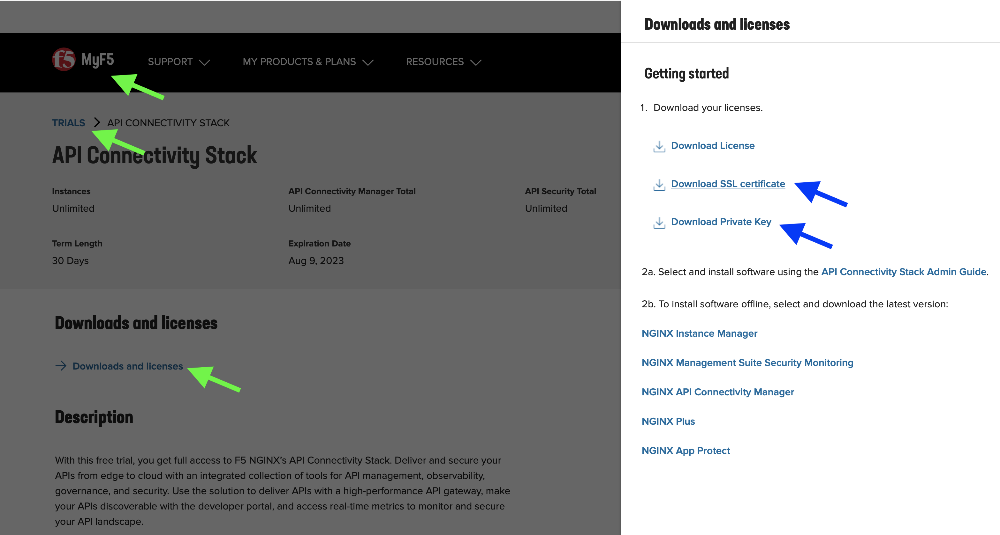

Deploy Nginx Plus Ingress Controller With App Protect
====

Prerequisite
----

You will need valid *NGINX* repo certificate to be able to access *NGINX Plus* software.

Log in to MyF5 Customer Portal and download your trial SSL certificate & private key.

Save them as ``nginx-repo.crt`` and ``nginx-repo.key`` to ``/home/ubuntu/setup`` directory.

Install Script
----

The steps are summarized in below shell script.
Examine install script ``nic.sh``::

  #!/bin/bash
  #
  # NGINX Plus Ingress Controller install script
  #
  
  if [[ -f "nginx-repo.crt" && -f "nginx-repo.key" ]]; then
    sudo mkdir /etc/docker/certs.d/private-registry.nginx.com
    sudo cp nginx-repo.crt /etc/docker/certs.d/private-registry.nginx.com/client.cert
    sudo cp nginx-repo.key /etc/docker/certs.d/private-registry.nginx.com/client.key
  
    # pulling nginx ingress image to local registry
    docker pull private-registry.nginx.com/nginx-ic-nap/nginx-plus-ingress:3.2.0
    docker tag private-registry.nginx.com/nginx-ic-nap/nginx-plus-ingress:3.2.0 local-registry:5000/nginx-ic-nap/nginx-plus-ingress:3.2.0
    docker push local-registry:5000/nginx-ic-nap/nginx-plus-ingress:3.2.0
  
    git clone https://github.com/nginxinc/kubernetes-ingress.git --branch v3.2.0
    
    cd kubernetes-ingress/deployments
  
    kubectl apply -f common/ns-and-sa.yaml
  
    # create RBAC
    kubectl apply -f rbac/rbac.yaml
    kubectl apply -f rbac/ap-rbac.yaml
    kubectl apply -f ../examples/shared-examples/default-server-secret/default-server-secret.yaml
    kubectl apply -f common/nginx-config.yaml
    kubectl apply -f common/ingress-class.yaml
  
    # create CRDs
    kubectl apply -f common/crds/k8s.nginx.org_virtualservers.yaml
    kubectl apply -f common/crds/k8s.nginx.org_virtualserverroutes.yaml
    kubectl apply -f common/crds/k8s.nginx.org_transportservers.yaml
    kubectl apply -f common/crds/k8s.nginx.org_policies.yaml
    kubectl apply -f common/crds/k8s.nginx.org_globalconfigurations.yaml
    kubectl apply -f common/crds/appprotect.f5.com_aplogconfs.yaml
    kubectl apply -f common/crds/appprotect.f5.com_appolicies.yaml
    kubectl apply -f common/crds/appprotect.f5.com_apusersigs.yaml
  
    # patching service account
    kubectl patch serviceaccount nginx-ingress -n nginx-ingress -p '{"imagePullSecrets": [{"name": "local-registry-cred"}]}'
  
    # update image
    sed -i 's/image: nginx-plus-ingress:3.2.0/image: local-registry:5000\/nginx-ic-nap\/nginx-plus-ingress:3.2.0/g' daemon-set/nginx-plus-ingress.yaml
  
    # enable app protect
    sed -i 's/#- -enable-app-protect$/\ - -enable-app-protect/g' daemon-set/nginx-plus-ingress.yaml
  
    # deploy ingress
    kubectl apply -f daemon-set/nginx-plus-ingress.yaml
  
    # KIC service
    kubectl apply -f service/nodeport.yaml
  else
    echo "Required nginx-repo.crt and/or nginx-repo.key files not found"
  fi

Execute the script::

  $ bash nic.sh
  
After finished, verify the deployment::

  $ kubectl -n nginx-ingress get all -o wide
  NAME                      READY   STATUS    RESTARTS        AGE   IP           NODE   NOMINATED NODE   READINESS GATES
  pod/nginx-ingress-p9jx6   1/1     Running   6 (3h25m ago)   38h   10.42.0.47   app    <none>           <none>

  NAME                    TYPE       CLUSTER-IP     EXTERNAL-IP   PORT(S)                      AGE   SELECTOR
  service/nginx-ingress   NodePort   10.43.181.81   <none>        80:32160/TCP,443:32691/TCP   38h   app=nginx-ingress

  NAME                           DESIRED   CURRENT   READY   UP-TO-DATE   AVAILABLE   NODE SELECTOR   AGE   CONTAINERS           IMAGES                                                      SELECTOR
  daemonset.apps/nginx-ingress   1         1         1       1            1           <none>          38h   nginx-plus-ingress   local-registry:5000/nginx-ic-nap/nginx-plus-ingress:3.2.0   app=nginx-ingress

At this point, the *Ingress Controller* is ready.