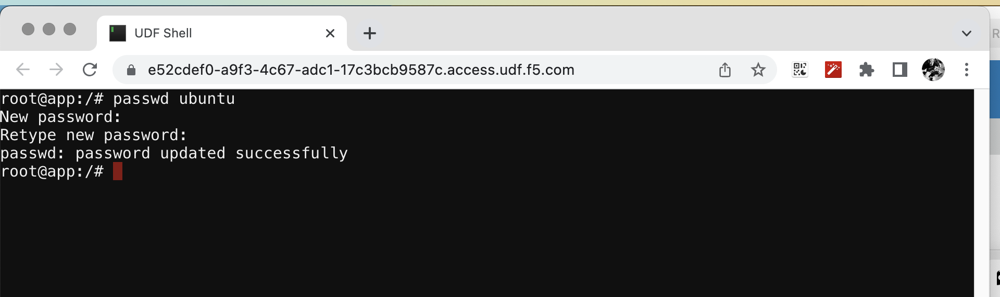
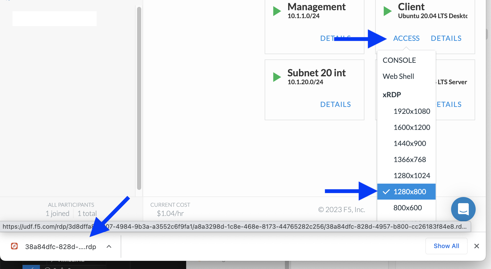

About The Lab
====

Topology
----

.. image:: img/topologi.jpeg

*Client* node
  This node will be used as jump host and test client. It uses RDP protocol to access.

*App* node 
  The place where the test application will be hosted. The test app is micro-services based hence *k3s* cluster installed in this node.

Your Deployment
----

Check you deployment status, it should be all green and ready.
You can see *ACCESS* button in *Client* and *APP* node.
Click on it to see access option to this node.

.. image:: img/deployment.png

Reset *ubuntu* User Password
----

Now we will change *ubuntu* user password as *ubuntu*

In your deployment, from *APP* node select *ACCESS > Web Shell*

.. image:: img/webshell.png

Use below command to change *ubuntu* user password::

    # passwd ubuntu

Use *ubuntu* as the *New password*

Access *Client* Node Using xRDP
----

Everything will be done over remote desktop.
This method protects from losing session when network disconnect happen.
You will need a RDP client installed in your laptop / PC.

In your deployment, from *Client* node select **ACCESS > xRDP > 1280x800**. A RDP file will be downloaded.

Click on downloaded RDP file to open in RDP client.
When prompted, enter credential *ubuntu/ubuntu* to login.

.. image:: img/xrdp2.png

After login, open *Terminal Emulator* from dock menu.

.. image:: img/dock-menu.png

then remove ``known_hosts`` file::

    $ rm /home/ubuntu/.ssh/known_hosts

Now access to *APP* node and use *ubuntu* as password when prompted::

    $ ssh app

Now you should be able to login to *APP* node as *ubuntu* user.