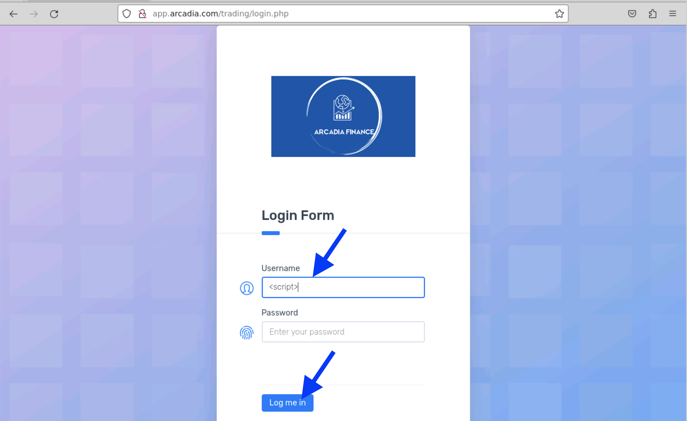

Test
====

Testing Without App Protect
----

.. warning:: in *APP* node

Apply ``vs-1.yaml`` manifest under ``/home/ubuntu/arcadia``::

  $ kubectl apply -f vs-1.yaml

.. warning:: in Firefox browser @ *Client*

1. Open http://app.arcadia.com/

#. Click *Login* button

#. Type ``<script>`` in Username input

#. Click *Log me in* button

Enable App Protect For Arcadia Virtual Server
----

  $ kubectl apply -f vs-2.yaml

Testing With App Protect Enabled
----

goto arcadia login page
user "jeruk" as user name --> blocked