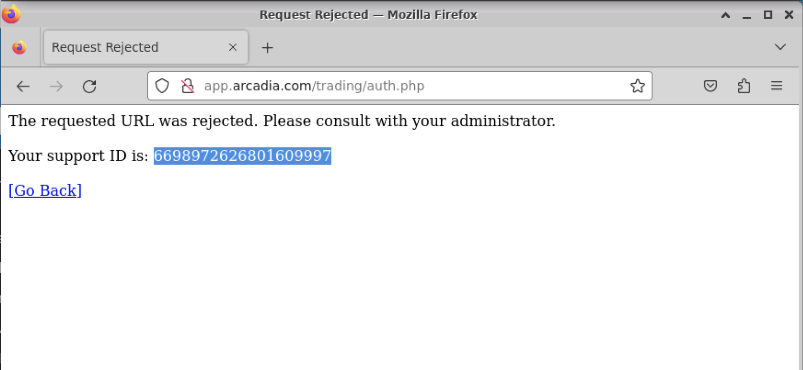

Test
====

Testing Without App Protect
----

**@APP Node**

Apply ``vs-1.yaml`` manifest under ``/home/ubuntu/arcadia``::

  $ kubectl apply -f vs-1.yaml

**@Client Node**

Open http://app.arcadia.com/ then click *Login* button

.. image:: img/test-a1.png

Type ``<script>`` in *Username* input then click *Log me in* button

.. image:: img/test-a2.png

You can see, the page is re-loaded.

Enable App Protect For Arcadia Virtual Server
----

**@APP Node**

Now we're going to enable application protection feature in *NGINX Plus Ingress Controller*

Apply ``vs-2.yaml`` manifest under ``/home/ubuntu/arcadia``::

  $ kubectl apply -f vs-2.yaml

Watch the log::

  $ podname=`kubectl get pods | awk '/^syslog/{print $1}'`; kubectl exec -it $podname -- tail -f /var/log/messages

Testing With App Protect Enabled
----

**@Client Node**

Back to Arcadia App login page, type ``<script>`` in *Username* input then click *Log me in* button.

Now, *Rejected Request* page displayed.

**@APP Node**

Check
goto arcadia login page
user "jeruk" as user name --> blocked

Install AB
----

sudo apt -y install apache2-utils

